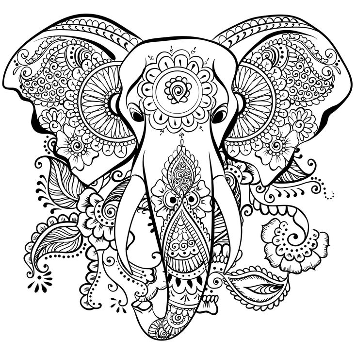

# AI_coloring

Style Transfer technique is used to add colors to coloring page

14 styles to choose from 

`style_image.py` is the main code. 

`invert_colors.py` makes more styles by inverting colors

`make_transparent.py` makes more styles by making the images transparent

### Input Images:

### Sample OutPut Images

